# SeewoServantLite

[](https://www.python.org/downloads/)
[](https://opensource.org/licenses/MIT)

实时监控火绒的隐私设备保护弹窗并通过UDP发送告警的小玩意

（防止班主任在学生不知情的情况下使用希沃白板监视班级情况）

你问为什么要检测火绒弹窗？因为不会驱动钩子...

另外项目名称 SeewoServant 灵感来自 Civil Servant 的谐音（谐音梗扣钱

## 📌 核心功能

- 🔍 实时检测火绒安全弹窗（支持摄像头/麦克风等隐私设备）
- 📡 基于UDP协议的即时告警通知
- ⚙️ 高度可配置的检测参数

## 🚀 快速开始

### 环境要求
- Windows 10/11
- Python 3.9+
- 火绒安全软件 5.0+

### 安装步骤
```bash
# 克隆仓库
git clone https://github.com/fengyec2/SeewoServantLite.git
cd SeewoServantLite

# 安装依赖
pip install -r requirements.txt
```

### 基础使用
```bash
# 直接运行
python tray_icon.py
```

## ⚙️ 配置说明

编辑 `config.ini` 文件：
```ini
[Detection]
target_class = ATL:00007FF637DAA9A0
title_keyword = 这里留空就好，火绒的隐私设备保护弹窗没有标题
check_interval = 0.5
HEARTBEAT_INTERVAL = 60

[Network]
udp_ip = 192.168.137.247
udp_port = 5005
cooldown = 2
```

| 参数            | 说明                         | 示例值                |
|-----------------|----------------------------|----------------------|
| target_class    | 目标窗口类名（需用Spy++获取） | ATL:00007FF637DAA9A0 |
| title_keyword   | 标题包含的关键词              |                       |
| check_interval  | 检测间隔（秒）               | 0.5                  |
| udp_ip          | UDP目标地址                 | 255.255.255.255      |
| udp_port        | UDP端口                     | 5005                 |
| cooldown        | 告警冷却时间（秒）           | 2                    |
| heartbeat_interval | 心跳间隔时间（秒）         | 60                   |

## 🔧 技术实现

### 检测原理

```mermaid
sequenceDiagram
    Loop 持续检测
        SeewoServantLite->>Windows API: EnumWindows()
        Windows API-->>SeewoServantLite: 返回窗口句柄列表
        SeewoServantLite->>SeewoServantLite: 验证类名/标题匹配
        alt 发现目标窗口
            SeewoServantLite->>UDP Client: 发送告警数据
            UDP Client->>Network: 广播消息
        end
    end
```


### 依赖组件
- `win32gui`: Windows GUI接口调用
- `pyinstaller`: 打包为可执行文件
- `psutil`: 进程管理

## 📦 项目打包

生成独立可执行文件：
```bash
# 安装打包工具
pip install pyinstaller

# 打包程序（生成dist/tray_icon.exe）
pyinstaller --noconsole --onefile --icon=resources/icon.ico --add-data "resources/icon.ico;resources" tray_icon.py
```

## ⚠️ 注意事项

1. 首次运行时需允许防火墙通过 UDP 通信
2. 实际类名/标题需根据本地火绒版本调整

## 📜 开源协议

本项目采用 [GPL-3.0](LICENSE)，欢迎贡献代码和提出改进建议！